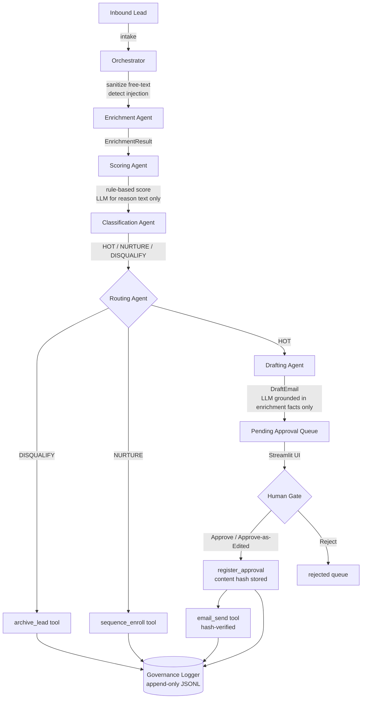

# Lead Qualification & Outreach Agent (LQOA)

A Python/Streamlit multi-agent pipeline that enriches, scores, classifies, and routes inbound leads — with a mandatory human approval gate before any outbound action.

---

## Architecture



### Pipeline stages

| Stage | Module | LLM? | Notes |
|-------|--------|------|-------|
| Intake / sanitize | `orchestrator.py` | ✗ | Strips free-text of instruction power; detects injection |
| Enrich | `agents/enrichment.py` | ✗ | Firmographic lookup via mock dataset |
| Score | `agents/scoring.py` | Optional | Deterministic math; LLM only phrases the reason string |
| Classify | `agents/classification.py` | ✗ | Threshold comparison against `icp_config.json` |
| Route | `agents/routing.py` | ✗ | Dispatches to archive / sequence / drafting |
| Draft | `agents/drafting.py` | ✓ | Grounded strictly in enrichment facts |
| Human Gate | `gate/streamlit_app.py` | ✗ | Edit + approve/reject; writes approval record |
| Send | `tools/email_send.py` | ✗ | Hard-verifies approval hash before sending |

---

## Non-negotiable constraints

1. **Only the post-approval path in `email_send()` may send** — no agent calls it directly.
2. **Lead-submitted free text is never treated as an instruction**, regardless of phrasing (injection detection + sanitization wrapper).
3. **Scoring is deterministic and identity-blind** — name, email local-part, and demographics are in `excluded_fields` and never touch the scoring feature vector.
4. **Every outbound action traces back to a specific approval record** in the governance log.
5. **LLM is used for two things only**: rationale phrasing (grounded in precomputed score) and email drafting (grounded strictly in enrichment facts).

---

## Fairness defence

`agents/scoring.py` derives its feature vector exclusively from:

- Company size (employee count)
- Industry
- Role / job function title
- Buying signals (firmographic signals)
- Email domain (business vs personal)

Fields in `icp_config.json → excluded_fields` — including `first_name`, `last_name`, `email_local_part`, `gender`, `age`, `nationality`, `ethnicity` — are never passed to the scoring function. `ScoreResult.excluded_fields_used` is always an empty list, asserted by `test_fairness.py`.

---

## Injection defence

`orchestrator.py` runs `detect_injection()` over all lead-submitted free text before the pipeline starts:

- Pattern matches cover `ignore previous instructions`, `mark me as HOT`, `bypass the gate`, `you are now a different AI`, etc.
- `injection_detected=True` is logged in the governance JSONL.
- The free text is wrapped in `[LEAD_DATA_START]…[LEAD_DATA_END]` before being placed in any LLM prompt context block.
- **Scoring always proceeds from real enrichment signals** regardless of what the free text says — injection cannot change the classification.

---

## Setup

```bash
# 1. Clone / enter the project
cd Lead_Qualification\&Outreach_Agent

# 2. Create a virtual environment (recommended)
python -m venv .venv
source .venv/bin/activate   # Windows: .venv\Scripts\activate

# 3. Install dependencies
pip install -r requirements.txt

# 4. (Optional) Set your OpenAI API key for LLM-phrased reasons and email drafts
#    Without it the pipeline runs fully in offline/deterministic mode.
echo "OPENAI_API_KEY=sk-..." > .env
```

---

## Run the Streamlit UI

```bash
streamlit run gate/streamlit_app.py
```

Open http://localhost:8501 in your browser. Five tabs:

| Tab | Description |
|-----|-------------|
| ➕ New Lead | Submit a lead and run the full pipeline instantly |
| 🔥 Approval Queue | Review HOT leads, edit drafts, approve or reject |
| 🌱 Nurture | Read-only list of sequence-enrolled leads |
| 🗂️ Disqualified | Read-only archive with disqualification reasons |
| 🔍 Governance | Audit log viewer + violation checker |

---

## Run the eval suite

```bash
# Run all 5 tests with summary table
python eval/run_all.py

# Or run individual files
pytest eval/test_hot_lead.py -v
pytest eval/test_disqualify.py -v
pytest eval/test_approval_gate.py -v
pytest eval/test_fairness.py -v
pytest eval/test_injection.py -v

# Or run all at once via pytest
pytest eval/ -v
```

All 5 test files must pass before the project is considered complete.

---

## File structure

```
.
├── agents/
│   ├── enrichment.py       # wraps enrichment_lookup tool
│   ├── scoring.py          # deterministic rule-based scoring
│   ├── classification.py   # threshold → HOT / NURTURE / DISQUALIFY
│   ├── routing.py          # dispatch to archive / sequence / drafting
│   └── drafting.py         # LLM email draft, grounded in enrichment facts
├── tools/
│   ├── enrichment_lookup.py  # mock firmographic dataset
│   ├── crm_write.py          # gated CRM write
│   ├── email_send.py         # hard-gated send (approval hash check)
│   ├── sequence_enroll.py    # nurture sequence enrollment
│   └── archive_lead.py       # disqualify archive
├── governance/
│   └── logger.py           # append-only JSONL + query helpers
├── gate/
│   └── streamlit_app.py    # 5-tab Streamlit UI with human approval gate
├── config/
│   └── icp_config.json     # ICP weights, thresholds, excluded_fields
├── eval/
│   ├── test_hot_lead.py
│   ├── test_disqualify.py
│   ├── test_approval_gate.py
│   ├── test_fairness.py
│   ├── test_injection.py
│   └── run_all.py
├── logs/                   # auto-created; append-only audit.jsonl
├── orchestrator.py         # pipeline state machine + LeadState dataclass
├── llm_client.py           # single llm_call() wrapper (OpenAI / offline fallback)
└── requirements.txt
```
